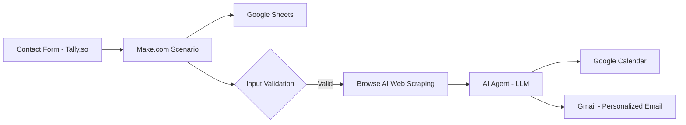

# 🤖 AI Business Automation Agent

An end-to-end, real-world automation that handles **contact form submissions, website research, meeting scheduling, and personalized email responses — fully automatically**.

This project demonstrates how to build a **production-ready AI automation** for a service business (e.g., a web design agency) using **Make.com**, AI agents, and common SaaS tools.

> Built as a practical example for showcasing **AI agents, workflow orchestration, and business automation** — not a toy demo.

---

## 🚀 Problem

Service businesses lose leads because:

* Contact form submissions are handled manually
* Website research is time-consuming
* Follow-ups are slow or generic
* Scheduling meetings requires back-and-forth emails

This results in **lost revenue, delayed responses, and poor customer experience**.

---

## 💡 Solution

This automation converts a raw contact form submission into a **fully handled lead**:

* Stores the lead
* Researches the client’s website
* Decides next steps using AI
* Schedules a meeting automatically
* Sends a personalized email response

All without human intervention.

---

## 🧠 What the Automation Does (End-to-End Flow)

1. **Trigger** – A user submits a contact form
2. **Data Storage** – Submission is saved in Google Sheets
3. **Validation** – Input is checked using conditional logic
4. **Website Research** – The client’s website is scraped for insights
5. **AI Decision-Making** – An AI agent analyzes the data
6. **Meeting Scheduling** – A calendar event is created automatically
7. **Personalized Outreach** – A custom email is sent to the lead

---

## 🔧 Architecture Overview

---

## 🛠️ Tech Stack

* **Automation Platform**: Make.com
* **Trigger**: Tally.so (Webhook)
* **Data Storage**: Google Sheets
* **Web Scraping**: Browse AI
* **AI / LLM**: Make.com AI Agent (LLM-powered)
* **Scheduling**: Google Calendar
* **Email**: Gmail

---

## 🤖 AI Agent Capabilities

The AI agent is responsible for:

* Interpreting form inputs
* Analyzing scraped website content
* Making workflow decisions
* Generating personalized email responses
* Coordinating with external tools (Calendar, Gmail)

This demonstrates **agentic AI behavior**, not just static prompt usage.

---

## 🔐 Guardrails & Safety

To ensure reliable and safe automation:

* Input validation filters prevent malformed URLs
* Conditional routing avoids unnecessary scraping
* Debugging tools are used to trace failures
* AI output is constrained to business-safe actions

---

## 🧪 Testing & Debugging

* Scenario execution logs in Make.com
* Step-by-step module testing
* Error inspection using built-in debugging tools
* Template reuse for faster iteration

---

## 📈 Business Impact

* ⚡ Instant response to inbound leads
* 🎯 Highly personalized outreach at scale
* ⏱️ Reduced manual effort
* 💰 Higher lead-to-meeting conversion

This automation is directly tied to **ROI and operational efficiency**.

---

## 🚀 How to Use / Recreate

1. Create a free Make.com account
2. Set up a webhook trigger using Tally.so
3. Connect Google Sheets for data storage
4. Add routers and filters for conditional logic
5. Integrate Browse AI for website research
6. Configure an AI Agent with LLM access
7. Connect Google Calendar and Gmail
8. Test and deploy the scenario

---

## 🎯 Who This Project Is For

* AI Product Managers
* Automation Engineers
* AI Engineers
* No-Code / Low-Code Builders
* Founders exploring AI-driven ops

---

## 🛣️ Future Enhancements

* CRM integration (HubSpot / Salesforce)
* Lead scoring using AI
* Multi-language email support
* Analytics dashboard for conversion tracking
* Human-in-the-loop approval flows

---

## 📌 Why This Project Matters

This project showcases:

* Real-world AI agent orchestration
* Practical business automation
* Safe, explainable AI workflows
* Systems thinking beyond prompts

Perfect for portfolios, interviews, and real deployments.

---

⭐ If you find this useful, feel free to star the repo!
